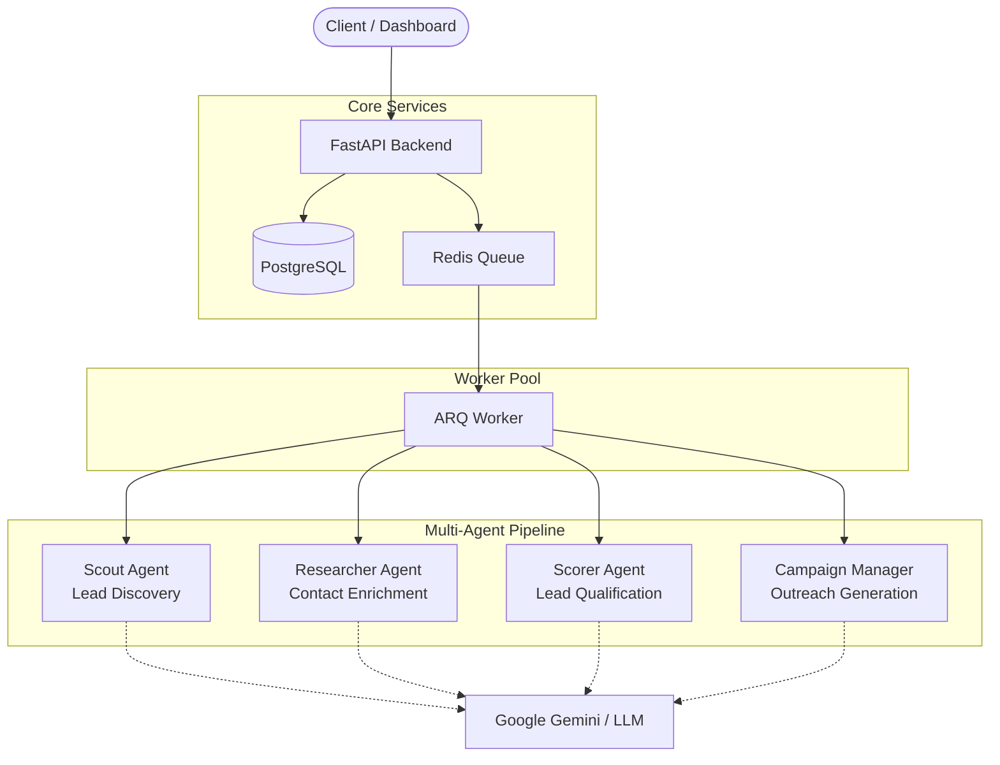

<div align="center">
  <h1>OUTUR AI</h1>
  <p><b>AI-powered outbound outreach automation platform</b></p>

  [](https://www.python.org/)
  [](https://fastapi.tiangolo.com/)
  [](https://redis.io/)
  [](https://www.docker.com/)
  [](LICENSE)
  []()
</div>

## Overview

Outur AI is an advanced, multi-agent platform designed to completely automate the B2B business development process. From initial lead discovery to personalized outreach, Outur AI acts as an autonomous sales development representative that never sleeps. 

The platform utilizes a sophisticated pipeline of AI agents—including a Scout, Researcher, and Scorer—to hunt down high-value companies and uncover key decision-makers. Instead of relying on generic email blasts, Outur AI generates hyper-personalized outreach messages based on deep research into a company's hiring signals, growth indicators, and public pain points.

Under the hood, Outur AI is built for scale. It leverages a robust architecture featuring a FastAPI backend, asynchronous PostgreSQL persistence, and Redis-backed ARQ queue workers. This allows the platform to process hundreds of leads in the background reliably, ensuring that research and email drafting happen concurrently without blocking the main application.

Outur AI is built for modern sales teams, recruiters, startup founders, and marketing agencies who need to scale their outbound efforts without sacrificing the quality and personalization of their messaging.

---

## Key Features

| Feature                | Description                         |
| ---------------------- | ----------------------------------- |
| 🤖 **AI Personalization**  | Generate tailored outreach messages |
| 📰 **Research Agent**      | Enrich company context              |
| 📬 **Campaign Automation** | Schedule and send outreach          |
| ⚡ **Redis + ARQ Queue**    | Background processing               |
| 📊 **Analytics Dashboard** | Track campaign performance          |
| 🔒 **Secure API**          | Token-based authentication          |

---

## System Architecture



---

## Screenshots

<div align="center">
  
  <br/>
  <em>Main Analytics Dashboard</em>
</div>

<br/>

<div align="center">
  
  <br/>
  <em>Campaign Manager & Lead Scoring</em>
</div>

---

## Tech Stack

| Layer            | Technology                   |
| ---------------- | ---------------------------- |
| Backend          | FastAPI                      |
| Queue            | Redis + ARQ                  |
| Database         | PostgreSQL                   |
| AI               | Google Gemini / LLM APIs     |
| Containerization | Docker Compose               |
| Language         | Python 3.12+                 |

---

## Quick Start

The fastest way to get Outur AI running is using Docker Compose.

```bash
# 1. Clone the repository
git clone https://github.com/Bankai11/outur-ai.git
cd outur-ai

# 2. Copy environment variables
cp .env.example .env

# 3. Add your Gemini API key to .env
# GEMINI_API_KEY="your_api_key_here"

# 4. Start all services
docker compose up -d --build

# 5. Run database migrations
docker compose exec app uv run alembic upgrade head
```

The API will be available at `http://localhost:8000`.

---

## Local Development

For active development, you can run the services locally using `uv`.

```bash
# 1. Install dependencies
uv sync

# 2. Start infrastructure (PostgreSQL & Redis only)
docker compose up -d postgres redis

# 3. Run database migrations
uv run alembic upgrade head

# 4. Start the FastAPI development server
uv run uvicorn api.main:app --reload --host 0.0.0.0 --port 8000

# 5. Start the background worker (in a new terminal)
uv run arq core.queue.worker.WorkerSettings
```

---

## Environment Variables

Configure these values in your `.env` file:

| Variable          | Purpose                                |
| ----------------- | -------------------------------------- |
| `DATABASE_URL`    | PostgreSQL connection string           |
| `REDIS_URL`       | Redis connection string                |
| `GEMINI_API_KEY`  | Google Gemini / LLM access key         |
| `APP_SECRET_KEY`  | JWT Authentication signing key         |

---

## How to Use

Follow this step-by-step guide to run your first outbound campaign:

1. **Create a company profile**: Define your target industry, location, and company size using the Scout Agent.
2. **Generate research context**: The Researcher Agent will automatically find key decision-makers and contacts associated with the discovered companies.
3. **Score and qualify leads**: The Scorer Agent grades the leads, filtering out low-quality targets and identifying Tier A prospects.
4. **Create an outreach campaign**: Group your Tier A leads into a structured campaign.
5. **Generate AI-personalized messages**: The Campaign Manager will use the research profiles to draft hyper-personalized email copy tailored to each specific contact.
6. **Queue and send messages**: Approve the drafts and dispatch them to the background worker queue for sending.
7. **Monitor analytics**: Track open rates, replies, and campaign performance via the dashboard.

---

## API Example

Launch a new discovery campaign via the REST API:

```bash
curl -X POST "http://localhost:8000/api/v1/campaigns" \
     -H "Content-Type: application/json" \
     -H "Authorization: Bearer YOUR_TOKEN" \
     -d '{
           "industry": "Artificial Intelligence",
           "country": "United States",
           "limit": 10
         }'
```

---

## Roadmap

- [x] Phase 1: Scout Agent & Database Architecture
- [x] Phase 2: Redis + ARQ Background Queue Setup
- [ ] Phase 3: Enrichment & Lead Scoring Agents
- [ ] Phase 4: Campaign Manager & Personalized Outreach
- [ ] Phase 5: CRM Analytics Dashboard
- [ ] Phase 6: Fully Autonomous End-to-End Pipeline

---

## Troubleshooting

**Redis connection errors**
Ensure the Redis container is running (`docker compose ps`). Check that `REDIS_URL` in your `.env` correctly points to `redis://localhost:6379/0` (or `redis://redis:6379/0` if inside Docker).

**Worker not processing jobs**
Make sure the ARQ worker process is running. If running locally, ensure you started it via `uv run arq core.queue.worker.WorkerSettings`. Check the worker logs for any unhandled exceptions.

**Docker build failures**
If `hatchling` fails to build due to a missing `README.md`, ensure your `Dockerfile` copies `README.md` during the dependency installation stage (`COPY pyproject.toml uv.lock* README.md ./`).

**Missing environment variables**
If you see validation errors on startup, double-check that your `.env` file exists in the root directory and contains all required variables, particularly `GEMINI_API_KEY` and `DATABASE_URL`.

---

## Contributing

We welcome contributions to Outur AI! To get started:

1. Fork the repository.
2. Create a new feature branch (`git checkout -b feat/amazing-feature`).
3. Ensure you write tests for any new functionality (TDD preferred).
4. Run the test suite and linters (`uv run pytest` and `uv run ruff check .`).
5. Commit your changes following Conventional Commits.
6. Push to your branch and open a Pull Request against `develop`.

---

<div align="center">
  <p>Built with ❤️ by the Outur AI team</p>
</div>
